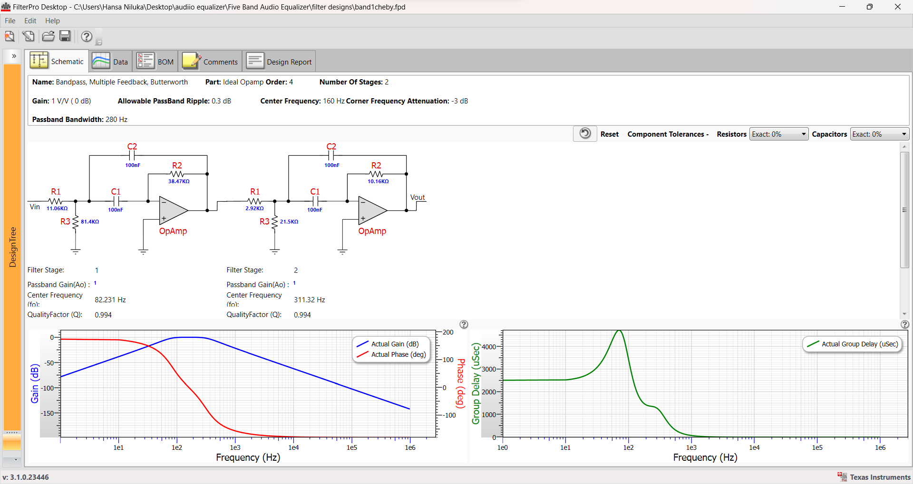
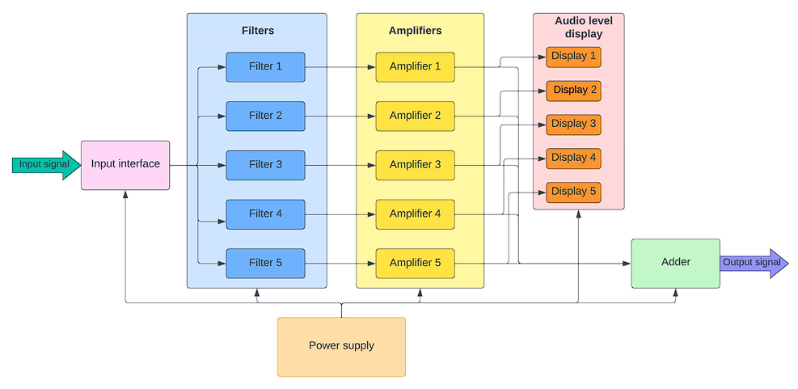
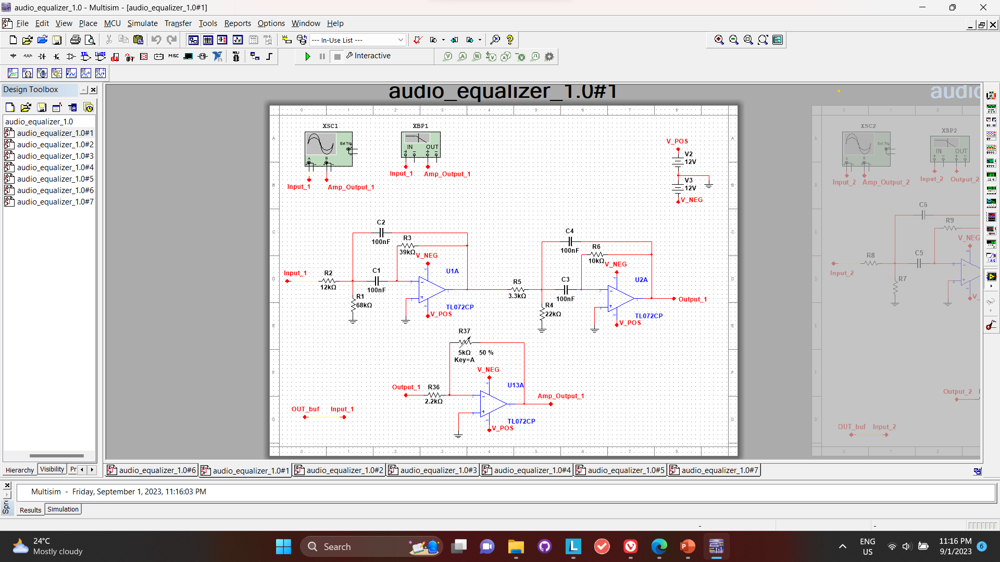
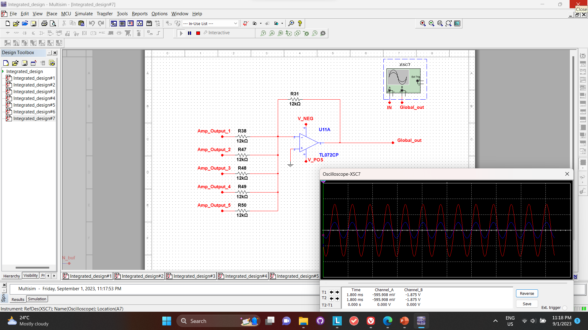
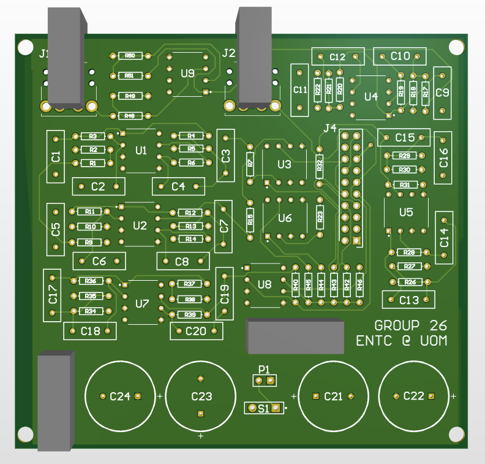
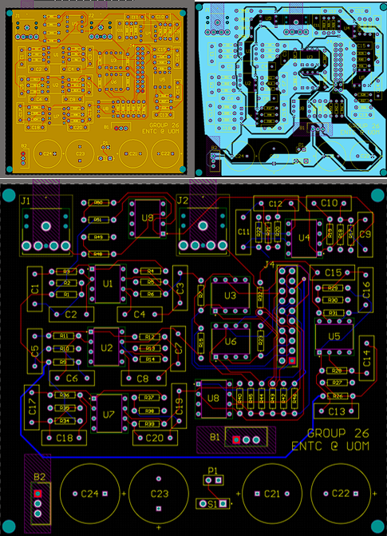
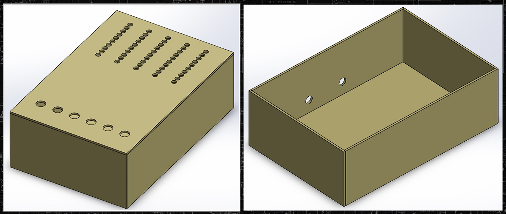

# Fiveband_equalizer

# Analog Fiveband Equalizer Project


Welcome to the Analog Fiveband Equalizer Project repository! This project focuses on designing and building an analog hardware equalizer capable of adjusting audio signal gain across five distinct frequency bands. With control over bass, low midrange, midrange, high midrange, and treble frequencies, this equalizer empowers users to customize their audio output to their preferred tonal balance.

## Features

- Five adjustable frequency bands: Bass, Low Midrange, Midrange, High Midrange, and Treble.
- Rotary potentiometers for controlling gain in each frequency band.
- Hardware implementation using analog circuitry.

## Filter Design using FilterPro Desktop by Texas Instruments

In the Analog Fiveband Equalizer Project, we have utilized the capabilities of FilterPro, a software tool developed by Texas Instruments, to design a sophisticated set of analog filters. These filters are integral to the equalizer's ability to adjust audio signal gain across five distinct frequency bands, enabling users to achieve a personalized tonal balance that meets their preferences.

FilterPro is an advanced tool tailored for engineers and enthusiasts working with analog filter design. Leveraging this software, we were able to design precise filters with calculated resistor and capacitor values that fulfill our specific frequency response requirements.

Designed Filters for Five Frequency Bands
The Analog Fiveband Equalizer incorporates five individual frequency bands, each designed to address specific audio frequency ranges. Here are the details of the designed filters:

+ Frequency Range: 20 Hz to 300 Hz
+ Frequency Range: 300 Hz to 1 kHz
+ Frequency Range: 1 kHz to 4 kHz
+ Frequency Range: 4 kHz to 10 kHz
+ Frequency Range: 10 kHz to 20 kHz

Filter Type: Butterworth Bandpass
Design: Multiple Feedback Topology
Resistor and Capacitor Values: Calculated using FilterPro

Each of these filters employs a Bandpass configuration to isolate the desired frequency range while attenuating frequencies outside the passband. The Multiple Feedback Topology, in combination with the Butterworth filter type, ensures smooth frequency response and minimal phase distortion.

By leveraging FilterPro's capabilities, we've been able to create precise and efficient analog filters that contribute to the enhanced audio customization offered by the Analog Fiveband Equalizer.

This project showcases the synergy of modern software tools and analog circuit design principles to create a feature-rich and versatile audio enhancement solution.

## System High-level Architecture


The system comprises a 3.5mm audio jack as the input interface, followed by a differential amplifier serving as an input buffer. Subsequently, the input signal is concurrently directed into five separate filter paths, where each path performs dedicated signal processing tasks or targets specific frequency bands. Amplification is applied individually within these filter paths to strengthen their respective components. Finally, the filtered and amplified signals are combined using an operational amplifier (op-amp) adder, yielding the ultimate processed audio output. This architecture is often employed in audio systems to split, process, and recombine multiple frequency components, commonly used for tasks such as audio equalization or specialized audio effects.

## Simulations


For simulation purposes, we utilized Multisim software to construct and test the entire system, ensuring that the chosen component values align with our desired outcome. This comprehensive simulation process allowed us to verify the functionality and performance of the system, ensuring its efficacy in real-world applications.



## PCB Designing


The design of a compact 4-layer PCB presented significant challenges due to the high component density. To address this, we strategically allocated the signal layers to the top and bottom, reserving the middle layers for ground and power planes. This configuration was essential for maintaining signal integrity and minimizing interference, ensuring the reliability and performance of the PCB in demanding environments.



## Enclosure Designing


## Project Structure

- `filter designs/`: filter designs (with calculated resistor values) .
- `project design file/`: schematics and pcb designs (using altium).
- `simulation files/` : simulations of integrated filters using multisim.
- `images/`: Images related to the project.

## Getting Started

1. Clone the repository:

   ```sh
   git clone https://github.com/yourusername/analog-equalizer.git
