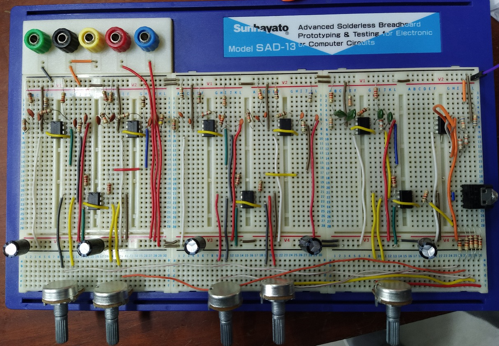

# Fiveband_equalizer

# Analog Fiveband Equalizer Project



This repository contains the source code and documentation for an Analog Fiveband Equalizer project. The project involves designing and building a hardware equalizer that can adjust the gain of audio signals across five different frequency bands. The equalizer provides control over the bass, midrange, and treble frequencies, allowing users to shape the audio output to their preferences.

## Features

- Five adjustable frequency bands: Bass, Low Midrange, Midrange, High Midrange, and Treble.
- Rotary potentiometers for controlling gain in each frequency band.
- Hardware implementation using analog circuitry.

## Project Structure

- `filter designs/`: filter designs (with calculated resistor values) .
- `project design file/`: schematics and pcb designs (using altium).
- `simulation files/` : simulations of integrated filters using multisim.
- `images/`: Images related to the project.

## Getting Started

1. Clone the repository:

   ```sh
   git clone https://github.com/yourusername/analog-equalizer.git
